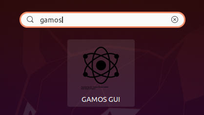

Configuration Requirements:
- Ubuntu >= 20
- System with Gamos >= 6.0 installed

To install the `gamos_gui` tool, follow these 2 steps:

## Step 1 - Install Accompanying Tools
This step needs to be performed only once. Subsequent version upgrades of `gamos_gui` do not require a repeat of this process.
Open Terminal and execute the following command:
```sh
wget -qO- https://raw.githubusercontent.com/trungnguyenthien/gamos_qt_gui/main/scripts/install.sh | sudo bash -s
```

## Step 2.1 - Install (Or Update) Gamos_Gui

Determine the version you wish to install or update. For example, to install gamos_gui version `1.0.0`, run the command below:
```sh
wget -qO- https://raw.githubusercontent.com/trungnguyenthien/gamos_qt_gui/main/scripts/update.sh | sudo bash -s -- "1.0.0"
```
Note, the "1.0.0" parameter can be changed depending on the version you want to install.

## Step 2.2 - Start `gamos_gui`
Open Terminal and execute the command:
```sh
gamos_gui
```
Or, open in menu...

# Released Versions
Refer to: https://github.com/trungnguyenthien/gamos_qt_gui/releases